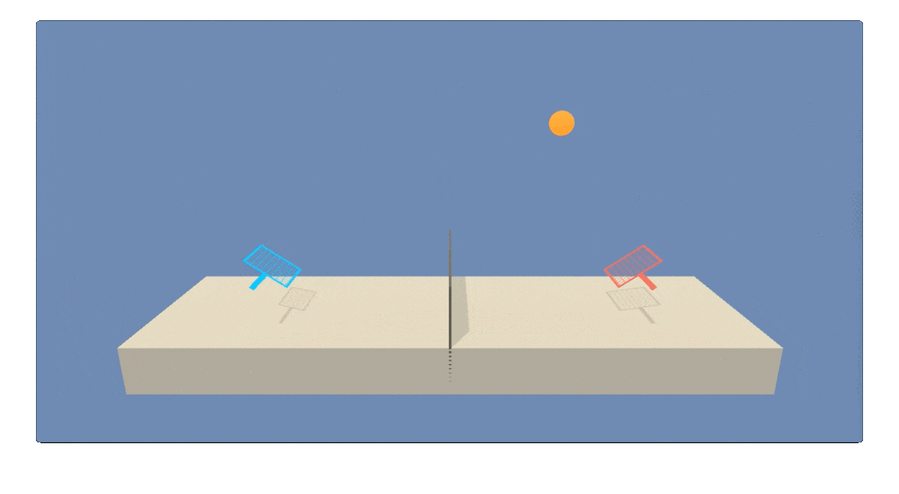

# Deep Reinforcement Learning for Continuous Control

Train agents to hit a ball back and forth in the Tennis environment from Unity ML-Agents using a multi-step variant of deep deterministic policy gradients (DDPG). 

Watch a full video of the agent here: [https://youtu.be/RLc08qHuOp4](https://youtu.be/RLc08qHuOp4)



## The  Environment

The Tennis environment in Unity ML-Agents features a tennis court with a net, ball, and two rackets. Agents control the rackets, which have two continuous action dimensions between -1 and 1. One action dimension controls position toward and away from the tennis net. The other action dimension controls vertical movement through a jump action. The observation space has eight variables respresenting position and velocity of the racket and the ball. Each state stacks three consecutive observations to help track movement. 

Agents receive a positive reward of +0.1 for hitting the ball over the tennis net and a negative reward of -0.01 for letting the ball hit the ground or out of bounds. Solving the environment requires a max score between the two agents of 0.5 averaged over 100 subsequent episodes. Episodes end when the ball hits the ground or out of bounds, so the agents are incentivized to rally the ball back and forth.

## Installation

1. Create and activate a  Python 3.6 environment. Choose an environment name in place of `my_env`.
```bash
conda create -n my_env python=3.6
source activate my_env
```

2. Create an IPython kernel for your new environment.
```bash
python -m ipykernel install --user --name my_env --display-name "my_env"
```

3. Clone this repository and install dependencies in the `python/` folder, which comes from the [Udacity Deep Reinforcement Learning](https://github.com/udacity/deep-reinforcement-learning) repository. These dependencies will include PyTorch and Unity ML-Agents Toolkit.
```bash
git clone https://github.com/supercurious/deep-rl-collaboration.git
cd python
pip install .
```

4. Download the Unity environment and unzip the file.
    * [Mac OSX](https://s3-us-west-1.amazonaws.com/udacity-drlnd/P3/Tennis/Tennis.app.zip)
    * [Linux (headless version for training on AWS)](https://s3-us-west-1.amazonaws.com/udacity-drlnd/P3/Tennis/Tennis_Linux.zip)
    * [Linux](https://s3-us-west-1.amazonaws.com/udacity-drlnd/P2/Reacher/Reacher_Linux.zip)
    * [Windows (32-bit)](https://s3-us-west-1.amazonaws.com/udacity-drlnd/P3/Tennis/Tennis_Windows_x86.zip)
    * [Windows (64-bit)](https://s3-us-west-1.amazonaws.com/udacity-drlnd/P3/Tennis/Tennis_Windows_x86_64.zip)

## Usage

1. Open the Jupyter notebook `REPORT.ipynb` for implementation and results.
```bash
jupyter notebook REPORT.ipynb
```

2. From the top menu bar, click on "Kernel", navigate to "Change kernel" and select the new environment you created during installation.